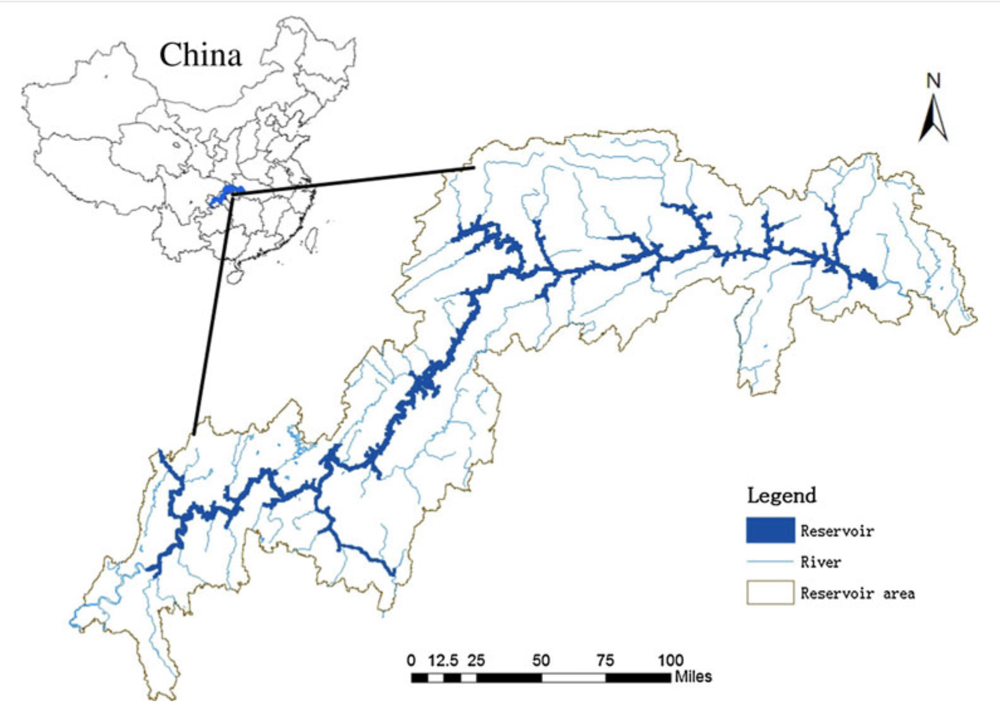

### Assignment 3 

### Introduction 

Project-induced displacement and resettlement are some of the serious effects of the construction of infrastructures. Large-scale development of infrastructure projects typically requires land, and sometimes very large tracts of land. This need for land can result in the dislocation of the people living there (Frank, 2017). Even in situations where people are not required to physically move, the project may still impact their livelihoods or income-generating activities (IFC 2002), or cause other environmental and social impacts that make continuing to live there untenable. Project-induced resettlement can occur on a massive scale, for example, there were nearly 1.13 million people had to be relocated to the Three Gorges Dam in China.
Two models, decision tree classifier and estimation of land production potential, are discussed in this passage to help us to understand how Three Gorges Dam (TGD) affected cropland change in the three gorges reservoir area and how it related to the project-induced displacement. 

### Firgure 1 
Location map of the Three Gorges Reservoir area 

*source*: Zhange et al., 2012
