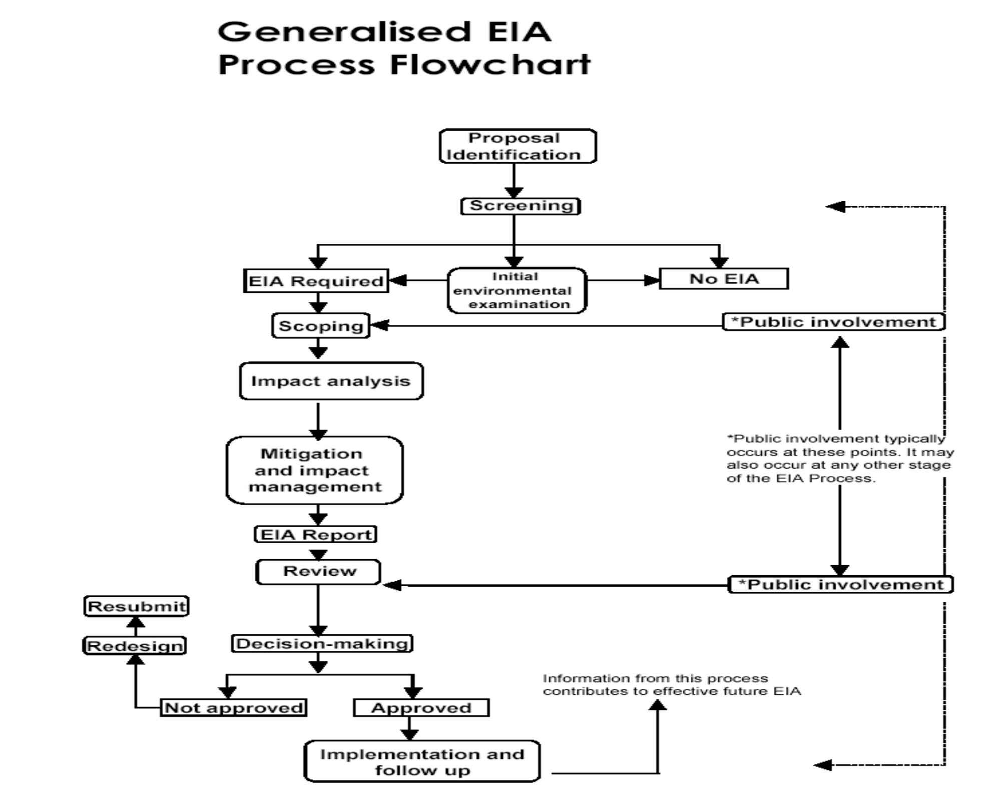

## How RS and GIS are contributing to our understanding of the problems in EIA. 

### Introduction 

The Environmental Impact assessment (EIA) is a decision-making tool intended to inform development decisions by mandating a consideration of alternatives and ways to prevent, mitigate, and control potential negative environmental and social impacts (Jennifer, 2008). It was originated in the United States in the late 1960s when people realized some significant environmental problems in the United States resulted from actions of conducting infrastructures itself. The scope of the term “environment” is broader than just biophysical environment. EIAs were meant to include all non-monetary impacts (i.e., impacts not included in a benefit-cost analysis) (Leonard & Anne, 1995). In other words, the focus is not just on scientific studies or environmental impact statements, it is on improving decisions. With the availability of the cutting-edge technology, EIA process has been improved. This literature review begins by discussing the challenges in EIA process and then describes how geospatial technology improves it especially. Subsequently, a case study of Three Gorges Project (TGP) in China will be discussed in detail about how remote sensing is contribute to the understanding of the population displacement.  

### Challenges are faced 

Although the EIA process is regarded as a first and foremost decision-making aid, there are still many obstacles we faced that will frustrate the effectiveness of this process. In the article *Environmental Impact Assessment: Challenges and Opportunities written by Leonard and Anne*, the authors list and analyze nine perennial problems in EIA implementation and also three new EIA and international environmental problems ranging from policy to technics. In general, the authors conclude that all of the problems fall into two types: systemic problems and secondary problems that are easier to solve. 

Firstly, the major systemic problems are (1) EIA is typically conducted as a one-time exercise, whereas the process of project design is cyclical and interactive (2) the EIA exercise is often conducted late in planning, often long after project proponents have become attached to a particular design concept (Leonard & Anne, 1995). These two problems lead the EIA can only propose the potential mitigation measurement instead of proposing or even mandating alternatives for the project, which violates the initial intention of having EIA. However, the difficulty of solving the first problem is it is hard to define the scope of a program when all of the decisions will often change and evolve which involves a lot of decision-making authorities. 

Secondly, the problems authors think is more amenable to a solution are (1) cumulative impacts are not assessed frequently (2) public participation in EIA is often inadequate (3) post-project monitoring, assessments of risk and social impacts are often omitted from EIAs (Leonard & Anne, 1995). These problems can be solved with the improvement of technology and also related policy. 

Cumulative impacts are defined as the “result of additive and aggregative actions producing impacts that accumulate incrementally or synergistically over time and space” (Contant and Wiggins 1993: 341). In the article *Environmental Impact Assessments in Developing Countries: An Opportunity for Greater Environmental Security?* written by Jennifer C. Li., the author states that the assessment of cumulative impacts is one of the most important challenges for EIAs. The reason is that many projects might pose minor risks to the environment in and of themselves but pose a significant risk to the environment in combination with other activities (Odum,1982). However, because of the methodological difficulties. It is hard to perform the assessment frequently. 

Inadequate public participation is another problem. Public involvement occurs too late to take advantage fully of information that citizens can contribute concerning values, impacts, and alternative projects (Leonard & Anne, 1995). Also, Jennifer C. Li (2008) notes that in developing countries, EIAs most often lack a public announcement or “notice of intent” advising about the imminent preparation of an EIA, a well-designed process for involving the public, and post-EIA monitoring. However, despite its advantages, we have to admit there are reasonable factors of why increase public participation in some countries is harder than the others such as the institutional context, funds, and the population. 

Leonard et al also mention the challenge of international development assistance that there’s a need to implement the new EIA requirements in a way that is both productive and sensitive to the local context (Leonard & Anne, 1995). This perspective is also presented in the lecture Development and Complexity taught by Owen Barder who suggests in a complex adaptive system, we need to avoid “isomorphic mimicry” which only creates something that looks like a good one but to take the local situation into account. Ann Hironaka (2002) concludes that because EIAs have been introduced into developing countries largely as a result of an internationally driven and mostly top-down process, they have been adopted more as a standardized, bureaucratized, procedural formality than as a real solution for intertwined environmental and socio-economic problems.


To sum up, although the article written by Leonard and Anne was published in 1995, it still provides an overview of the problems in two types. The second type of the challenges can be improved easily. 

### Technologies are applied 

Leonard et al define the problems that can be solved with the availability of new technologies as more amenable to solution. In this part of the literature review, I will first discuss the general steps involved in the EIA process and then two technologies, remote sensing (RS) and geographical information system (GIS), that are frequently being used and how they improve the EIA process. 

The general steps in the EIA process are designed to ensure all problems and potential linkages can be presented. To are more specific, it includes (a) screening which is done to determine whether or not a proposal should be subject to EIA (Anjali et al, 2016) (b) scoping that identify the key issues of concern at an early stage in the planning process (Ahmed & Sammy, 1987) (c) an EIA report (consideration of alternatives, identification of major impacts, and mitigation measures) (Jennifer, 2008) (d) public participation and (e) review. A visualization of this structure is presented in Figure 1.

### Figure 1

Generalized EIA Process Flow-Chart

Remote sensing is the process of acquiring and interpreting geographic data without physical contact. It relies upon the measurement of electromagnetic energy reflected or emitted from the features of interest (Pezhman et al, 2008). Some advantages are RS can retrieve a large number of data which reduces manual fieldwork greatly, allows retrieval of data in regions difficult to access, and allows the collection of more data in a short period of time. Even though remote sensing technology has limited ability to interpret the data, it is still useful in obtaining baseline information for establishing baseline conditions of an area at the pre-project analysis stage, as well as monitoring changes in the environmental conditions of such area (Pezhman et al, 2008).

GIS is a computer-assisted system for the acquisition, storage, analysis, and display of geographically are spatially referenced data. The power of a GIS lies in its ability to bring both the spatial and attribute data within a common framework to form a unified database system; and its ability to compare different entities based on their common geographic occurrence through the overlay process (Pezhman et al, 2008). This is extremely important in the EIA process which always needs to take many different variables and phenomena into consideration at the same time. However, its powerful function, the application of GIS in the EIA process is limited to the fundamental GIS functions such as map production and report preparation which are common for scoping stage in identifying the main environmental issues to be examined. 

In general, RS and GIS technology allow us to access data for analysis more quickly and accurately than by manual procedures. They are helpful in decision-making which can evaluate the feasible alternatives and visualize the results of the choice. Scientists see the potential power of these technologies, but there’s still a need for further improvement and the integration of the RS and GIS with other operations to fully use the potential of these two technologies and better support the EIA process.  

### Three Gorges Project 

Development and climate change mitigation and adoption projects increasingly involve large-scale infrastructure projects (e.g., hydropower, irrigation, and water transfer projects) (Xibao et al, 2013). China is a good example of this. The Three Gorges Project (TGP) on the Yangzi River in China is the world’s largest hydroelectric power project. This completed system encompasses a dam, two powerhouses with a total of 22,500 MW of hydropower generation and around 100 billion kilowatts which accounts for 2.5% of the national power generation a year, and also water navigation facilities. However, such projects are growing in their potential to displace massive numbers of people and will continue to yield a range of environmental consequences in the affected countries or regions in the near future (United Nations Environmental Program, 2007; Cernea, 2008). 

Duncan A Rouch (2019) compares the original EIA report and the actual outcomes in this article, Three Gorges Project, China Environmental and Social Impacts, the Three Gorges Project. He then concludes that TGP clearly focused on topographical, geographical, and hydrological aspects, even though social and environmental impact assessments were performed before construction. This is because, in comparison, he finds the original EIA report substantially underestimated outcomes in displacement and land carrying. 

Besides the total number of people who need to be resettled, another problem is where will the migrants move to. There are three major approaches for resettlement which are settling in nearby areas, moving far away, and moving to urban enterprises. In the research conducted by Li Heming and Philip Rees (2000), they argue that the approach which settling in nearby areas is favored by TGP’s planners because it can prevent labor from flowing out of the local area, help promote the project and avoid potential issue affecting social stability. However, the first approach is not as perfect as the planners initially think. For a long time, the proponents of the project have argued that: 

‘In terms of the willingness of local governments and migrants, all relocatees can be resettled locally. It is unnecessary to move them out of the county and the majority of them can be resettled within the township.’(REG, 1988: 14) 

However, in the end, the arable slope land should be only 300,000 mu (1 mu = 0.067 ha) rather than 4 million mu as the planners initially suggest (Chen et a, 1995). This underestimation may due to the cumulative impacts didn’t take into account at first and also the lack of public participation as talked about in the first section.  

In the study of Zhang Lei et al (2012), remote sensing was employed to monitor pattern dynamic of the cropland, cropland quality, and cropland cultivation intensity in the Three Gorges reservoir area (TGRA) during the implementation period of TGP, 1992 to 2007, and discuss the driving forces of cropland change. The results showed that the cropland area decreased by 4%. Of the decrease, the high-yield cropland accounted for 61%. This led to a decline in the quality of the entire cropland (Zhang et al, 2012). By overlapping the cropland productivity map and cover conversion map, they conclude the driving forces of cropland quality degradation are urban sprawl, resettlement which led to the indirect cropland occupation, and reservoir submergence that led to immediate consequences of cropland loss. 

Li , one of the planners of the project claims that infra-red aerial photography shows that in the reservoir area more than 20 million mu of barren land is available, of which 4 million mu of slope land is in the resettlement villages that are to receive relocatees. However, Li’s estimate is problematic because it fails to take into account the physical setting in the Three Gorges area, including elevation, gradient, soil conditions, provision of water, and so forth. 

The study conducted by Zhang et al (2012) is an example of post-assessment for EIA and helps understand why the initial resettlement approach fails to meet expectations. By analyzing the quality change of cropland in TGRA, we can also understand how resettled in nearby areas migrants’ life quality change after the resettlement. 

### Conclusion

This literature review identifies the general problems in the EIA process and how the emergence of new technologies can solve one type of problem discussed above. Three Gorges Project is discussed as an example of how remote sensing is used in post-assessment that provides a holistic and objective understanding of underestimation in population resettlement for the initial EIA report. Most of the research papers I found only discuss the advantage of using remote sensing and GIS technology but avoid the potential drawbacks and the way further for better integrating these techniques into the EIA process. Besides the technology, other factors that lead to the underestimation of resettlement population still needs to be discussed.  

### References

Ahmad, Y J. and Sammy, GK. (1987). Guidelines to Environmental Impact Assessment in Developing      Countries‖, UNEP Regional Seas Reports and studies no. 85, UNEP. 

Cernea, M., 2008. Compensation and Investment in Resettlement: Theory, Practice, Pit- falls, and Needed Policy Reform. In: Cernea, M., Mathur, H.M. (Eds.), Can Compensation Prevent Impoverishment? Oxford University Press, New Delhi, pp. 147–179. 

Chen GJ, Xu Q, Du RY. 1995. Sanxia Gongcheng dui shengtai yu huanjing de yingxiang ji duice yanjiu (Impact of the TGP on environment and Solution). Science Pres: Beijing, China. 

Cheryl K. Contant, Lyna L. Wiggins (1991). Defining and analyzing cumulative environmental impacts, Environmental Impact Assessment Review, Volume 11, Issue 4, Pages 297-309, ISSN 0195-9255, https://doi.org/10.1016/0195-9255(91)90003-3.

Heming, L., & Rees, P. (2000). Population displacement in the Three GORGES Reservoir area of the Yangtze River, central china: RELOCATION policies and MIGRANT VIEWS. International Journal of Population Geography, 6(6), 439-462. doi:10.1002/1099-1220(200011/12)6:63.0.co;2-l

Hironaka, Ann. 2002. The globalization of environmental protection: The case of environmental impact assessment. International Journal of Comparative Sociology 43 (1): 65–79. 

Lei, Z., Bingfang, W., Liang, Z., & Peng, W. (2012). Patterns and driving forces of cropland changes in the Three Gorges area, china. Regional Environmental Change, 12(4), 765-776. doi:10.1007/s10113-012-0291-8

Li, J.C. (2008). Environmental Impact Assessments in Developing Countries: An Opportunity for Greater Environmental Security?
https://www.semanticscholar.org/paper/Environmental-Impact-Assessments-in-Developing-An-Li/82173ed5ba23c8198c21bb653464a3866ade0942

Ortolano, L., & Shepherd, A. (1995). Environmental impact assessment: Challenges and opportunities. Impact Assessment, 13(1), 3-30. doi:10.1080/07349165.1995.9726076

REG (Resettlement Expert Group of the TGP) 1988. Sanxia gongcheng yimin xiangmu kexingxing yanjiu baogo (Feasibility Report on Resettlement Scheme of the TGP). Water Conservancy Press: Beijing, China. 

Rouch, D. A. (2019) Role of Geographical Information Systems in Promoting Sustainable Agriculture, Working Paper No. 8, Clarendon Policy & Strategy Group, Melbourne 

Roudgarmi, Pezhman & Khorasani, Nematollah & Monavari, Seyed & Nouri, J Nouri (2008). Alternatives evaluation in EIA by spatial multi-criteria evaluation technique. Journal of Food, Agriculture and Environment. 
https://www.researchgate.net/publication/267382455_Alternatives_evaluation_in_EIA_by_spatial_multi-criteria_evaluation_technique

United Nations Environmental Program (UNEP), 2007. Dams and Development: Relevant Practices for Improved Decision-Making. Progress Press Ltd., Malta (192 pp.). 

Vivek Kumar Tiwari, A. V. A. K. (2016). Role of Remote Sensing and Geographical Information System in Environmental Impact Assessment of Developmental Projects for Environmental Management. International Journal of Scientific Research and Management, 4(9). 

